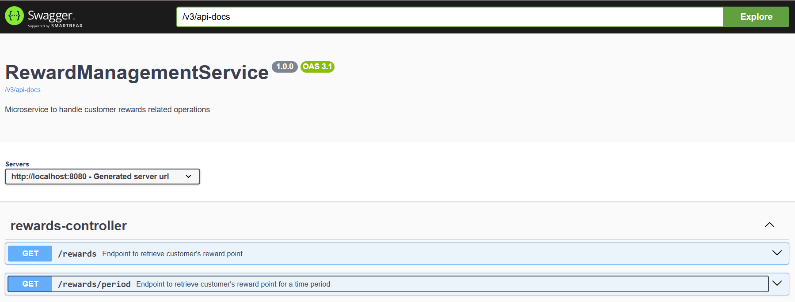
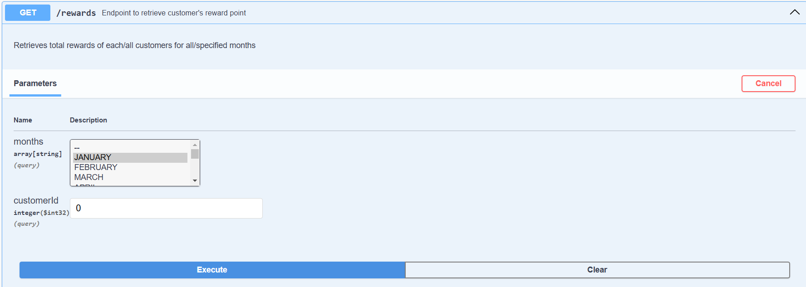
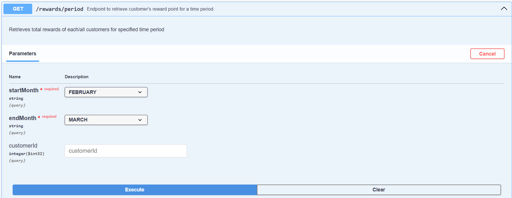

# OrderManagementService
This is a spring boot microservice to handle operations related to customer's rewards. It contains REST Endpoints to retrieve total rewards earned by customers.

## Getting Started

### Prerequisites

- Java : 23  
- Spring Boot: 3.4.3
- Gradle

### How to run locally

Follow below steps to run application locally
1) Clone repository and import to IDE: ``` git clone https://github.com/aslampsherif/RewardManagementService.git ```
2) Right click on OrderManagementServiceApplication.java and run as spring boot application
3) Go to http://localhost:8080/swagger-ui/index.html#/ to see swagger documentation.
    

### Project structure

#### src/main/java/com/myStore/rewardManagement
- config (Contains configuration classes)
  - SwaggerConfig.java: Contains configuration for swagger.
- controller (Contains controller layer classes)
  - RewardsController.java: Contains endpoints related to rewards.
- dto (Contains data transfer classes)
  - Address.java: Represents address of customer.
  - Customer.java: Represents customer details like name, address.
  - RewardsResponse.java: Represents the response for endpoints related to rewards.
  - Transaction.java: Represents transaction details of customer like transaction amount, transaction time. 
- exception (Contains classes related to exceptions)
  - ExceptionResponse.java : represents the general response of endpoints when exception occur.
  - GlobalExceptionHandler.java: Handle exception from application.
  - ServiceException.java: An Application level exception class.
- service (Contains service layer classes)
  - RewardsService.java: Handle business logic to calculate reward points and retrieve all customer details including total rewards.
- utility (Contains utility classes)
  - MockDataUtility.java: Used to set up mock data and send to service layer class.

### API Details

1. **Rewards controller**
   1. **GET /rewards** :
   
   
            Description:
                    End point is used to retrieve reward details of all customers for all months.
                    It accepts two optional parameters. List of months and customer ID.
                    If Customer id is provided, then it will return reward details of that customer.
                    If List of months is provided, then it will return reward details for those months.
                    If both customer Id and List of months are provided, then it will return reward details of that customer for specified month
            
            Sample Request: http://localhost:8080/rewards?months=JANUARY&months=FEBRUARY&months=MARCH&customerId=1
            Sample Response:
                [
                    {
                        "customerDetails": {
                            "customerId": 1,
                            "name": "Aslam",
                            "phoneNumber": 9876543210,
                            "address": {
                                "street": "601 Corner Meadows Way",
                                "city": "Calgary",
                                "province": "Alberta",
                                "zip": "T3N 2C5"
                            }
                        },
                        "rewardPoints": {
                            "JANUARY": 25,
                            "MARCH": 35,
                            "FEBRUARY": 140,
                            "totalRewardPoints": 200
                        }
                    }
                ]
      2. **GET /rewards/period** :  
       
   
               Description:
                       End point is used to retrieve reward details of all customers for specified months.
                       It accepts three parameters. Customer id which is optional, start month and end month of period.
                       If Customer id is provided, then it will return reward details of that customer.
            
               Sample Request: http://localhost:8080/rewards/period?startMonth=FEBRUARY&endMonth=MARCH&customerId=3
               Sample Response;
                   [
                        {
                            "customerDetails": {
                                "customerId": 3,
                                "name": "Teja",
                                "phoneNumber": 9876543212,
                                "address": {
                                    "street": "603 Corner Meadows Way",
                                    "city": "Calgary",
                                    "province": "Alberta",
                                    "zip": "T3N 2C5"
                                }
                            },
                            "rewardPoints": {
                                "MARCH": 290,
                                "FEBRUARY": 189,
                                "totalRewardPoints": 479
                            }
                        }
                    ]
### Initial data setup.

To validate the endpoints, customer([Customers.json](src/main/resources/data/Customers.json)) and transaction([Transactions.json](src/main/resources/data/Transactions.json)) details are stored in json file. Utility class [MockDataUtility.java](src/main/java/com/myStore/rewardManagement/utility/MockDataUtility.java) is used to get these values and send to service layer

| Customer | Month 1 Transactions | Month 2 Transactions | Month 3 Transactions |
|----------|----------------------|----------------------|----------------------| 
| 1        | 20                   | 100                  | 30                   |
| 1        | 50                   | 120                  | 65                   |
| 1        | 75                   | 20                   | 70                   |
| 2        | 35                   | 120                  | 48                   |
| 2        | 80                   | 20                   | 68                   |
| 2        | 99                   | 125                  | 20                   |
| 3        | 20                   | 100                  | 220                  |
| 3        | 20                   | 99                   | 20                   |
| 3        | 20                   | 120                  | 20                   |